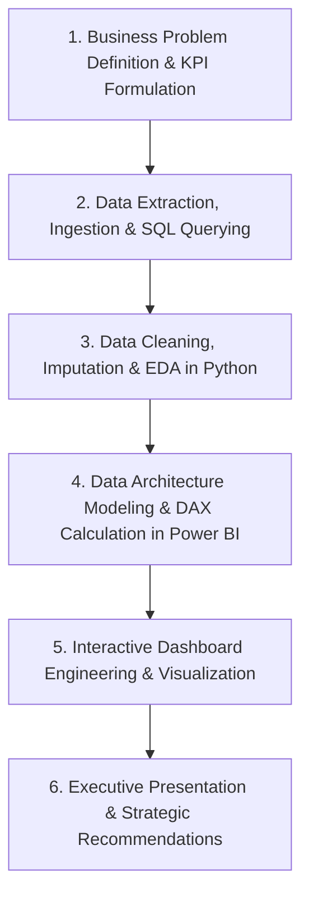

# 📄 Sharvesh Pandey - Comprehensive Professional Profile & Portfolio

> **Data Analyst | Business Intelligence & Machine Learning Specialist**  
> *Transforming Complex Data into Strategic Business Insights & Interactive Visualizations*

---

## 👤 Personal & Contact Overview

- **Full Name:** Sharvesh Pandey
- **GitHub Handle:** [@sharvesh-analytics](https://github.com/sharvesh-analytics)
- **LinkedIn Profile:** [linkedin.com/in/sharvesh-analytics](https://www.linkedin.com/in/sharvesh-analytics)
- **Email:** [pandeysharvesh0410@gmail.com](mailto:pandeysharvesh0410@gmail.com)
- **Location:** India
- **Primary Roles:** Data Analyst, BI Developer, Data Visualization Engineer, Junior ML Specialist

---

## 🎯 Executive Summary

Results-driven **Data Analyst** with strong expertise in **SQL data extraction, Python exploratory data analysis (EDA), Power BI dashboard engineering, and predictive machine learning**. Proven track record in designing interactive analytical solutions across multiple business domains including **Financial Services, Healthcare, E-Commerce Logistics, Ride-Sharing Mobility, and Digital Media Streaming**.

Passionate about automating data pipelines, crafting advanced DAX measures, writing production-level SQL queries (CTEs, Window Functions), and delivering actionable insights that optimize business operations and drive executive decision-making.

---

## 🛠️ Technical Skills & Tooling Matrix

| Category | Tools & Technologies | Mastery / Applications |
| :--- | :--- | :--- |
| **Programming Languages** | Python (3.x), SQL | Data Cleaning, Exploratory Analysis, Scripting, Database Queries |
| **Data Analysis & ML** | Pandas, NumPy, Scikit-Learn, SciPy | Data Wrangling, Feature Engineering, Regression, Classification, Forecasting |
| **Data Visualization** | Power BI, Seaborn, Matplotlib, Excel | Executive Dashboards, Geo Mapping, Custom Tooltips, Pivot Tables |
| **Databases & Querying** | PostgreSQL, MySQL | Joins, Subqueries, Common Table Expressions (CTEs), Window Functions |
| **BI & Data Modeling** | DAX, Power Query, Star Schema | Calculated Columns, Measures, Data Relationships, ETL |
| **Version Control & DevOps**| Git, GitHub, VS Code, Jupyter | Repository Management, Notebook Execution, Script Automation |

---

## 📊 Complete Portfolio Projects Breakdown

### 1. 🎬 Netflix Global Market Analysis & Content Strategy
- **Repository:** [sharvesh-analytics/Netflix_Market_Analysis](https://github.com/sharvesh-analytics/Netflix_Market_Analysis)
- **Domain:** Digital Media & Streaming Entertainment
- **Tech Stack:** Python (Pandas, Seaborn), SQL, Power BI
- **Overview:** End-to-end analytics platform evaluating content acquisition trends, movie-to-TV show ratios, genre saturation, and regional production hubs across 8,000+ titles.
- **Key Business Takeaways:**
  - Identified strategic shift toward episodic TV series for long-term subscriber retention.
  - Mapped regional production dominance across US, India, and UK streaming markets.

---

### 2. 🏦 Allahabad Bank Financial Operations & Risk Analytics
- **Repository:** [sharvesh-analytics/Allahabad_Bank_Details_Data_Dashboard](https://github.com/sharvesh-analytics/Allahabad_Bank_Details_Data_Dashboard)
- **Domain:** Banking & Financial Services
- **Tech Stack:** Power BI Desktop, DAX, Excel, Data Modeling
- **Overview:** Interactive financial dashboard analyzing customer credit score distributions, loan default ratios, account balance demographics, and churn risk factors.
- **Key Business Takeaways:**
  - Segmented borrowers into Credit Risk Bands to streamline loan approval workflows.
  - Isolated balance and tenure thresholds strongly correlated with customer account attrition.

---

### 3. 🛒 Amazon Global Export & Cross-Border Logistics Dashboard
- **Repository:** [sharvesh-analytics/Amazon-Global-Export-Cross-Border-Trade-Dashboard](https://github.com/sharvesh-analytics/Amazon-Global-Export-Cross-Border-Trade-Dashboard)
- **Domain:** E-Commerce Supply Chain & Cross-Border Trade
- **Tech Stack:** Power BI, Power Query, DAX Modeling, Geo Maps
- **Overview:** Supply chain analytics solution tracking international seller net margins, shipping freight overheads, customs duty impacts, and destination country revenue streams.
- **Key Business Takeaways:**
  - Pinpointed top destination countries delivering over 70% of international net profit.
  - Modeled customs duty scenarios to optimize product export margins.

---

### 4. 🏥 Apollo Hospital Healthcare Analytics & AI Demand Forecasting
- **Repository:** [sharvesh-analytics/Apollo-Hospital-Healthcare-Analytics-AI-Forecasting-Dashboard](https://github.com/sharvesh-analytics/Apollo-Hospital-Healthcare-Analytics-AI-Forecasting-Dashboard)
- **Domain:** Healthcare & Clinical Operations
- **Tech Stack:** Python, Pandas, Scikit-Learn, Power BI
- **Overview:** Healthcare intelligence platform mapping patient admission rates, emergency ward loads, length-of-stay (LOS) metrics, and machine learning demand forecasting.
- **Key Business Takeaways:**
  - Built ML predictive time-series models to forecast weekly patient inflow.
  - Reduced hospital resource allocation bottlenecks for ICU beds and emergency shifts.

---

### 5. 🛒 Advanced E-Commerce Sales & CLV Analysis in SQL
- **Repository:** [sharvesh-analytics/E-COMMERCE_SALES_BY_SQL](https://github.com/sharvesh-analytics/E-COMMERCE_SALES_BY_SQL)
- **Domain:** E-Commerce Retail & Customer Behavior
- **Tech Stack:** PostgreSQL, MySQL, Complex SQL Queries
- **Overview:** Enterprise SQL code repository solving real-world retail analytics challenges including Month-over-Month (MoM) revenue growth, RFM segmentation, and Customer Lifetime Value (CLV).
- **Key Technical Features:**
  - Production-ready SQL queries utilizing `CTEs`, `LAG()`, `LEAD()`, `DENSE_RANK()`, and `NTILE()`.

---

### 6. 🚖 Ola Cabs Mobility Analytics & Ride-Sharing Dashboard
- **Repository:** [sharvesh-analytics/OLA_DATASET_ANALYTICS_SQL](https://github.com/sharvesh-analytics/OLA_DATASET_ANALYTICS_SQL)
- **Domain:** Urban Mobility & On-Demand Transportation
- **Tech Stack:** Power BI, SQL, DAX Measures
- **Overview:** Ride-sharing analytics dashboard evaluating trip completion rates, peak-hour surge pricing demand, driver ratings, and cancellation root causes.
- **Key Business Takeaways:**
  - Identified peak demand windows across urban pickup zones to improve driver allocation.
  - Visualized payment gateway distribution (UPI, Cash, Credit Cards) across ride segments.

---

## 📈 Analytics Workflow & Problem-Solving Methodology

---

## 📑 Portfolio Project Matrix

| Project | Industry Domain | Core Tech Stack | Primary Objective |
| :--- | :--- | :--- | :--- |
| **Netflix Market Analysis** | Media & Streaming | Python, SQL, Power BI | Content strategy & library expansion analytics |
| **Allahabad Bank Dashboard**| Banking & Finance | Power BI, DAX, Excel | Financial risk & customer churn analysis |
| **Amazon Cross-Border Trade**| E-Commerce Logistics| Power BI, DAX, Maps | Global export profitability & freight analysis |
| **Apollo Healthcare Analytics**| Healthcare & AI | Python, ML, Power BI | Patient flow & emergency bed forecasting |
| **E-Commerce Sales SQL** | Retail Analytics | PostgreSQL, MySQL, CTEs | Sales growth, CLV & RFM SQL analysis |
| **Ola Mobility Analytics** | Transport & Mobility| Power BI, SQL | Ride completion, surge revenue & driver rating analytics |

---

  Generated for Sharvesh Pandey | Data Analyst & BI Specialist

